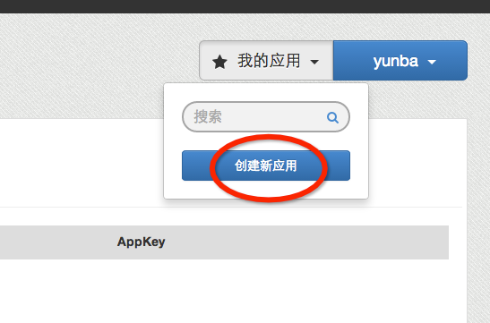

# Yunba RESTful API 快速入门

## 注册开发者账号

打开 <http://yunba.io>, 点击注册创建账号。


## 创建应用
注册账号成功跳转到我的应用界面，点击我的应用 --> 创建新应用，输入应用名称和包名



## 方法

### HTTP POST 

请求 JSON 格式如下:

```json
{"method":<method>, "appkey":<app-key>, "seckey":<secret-key>, "topic":<topic>, "msg":<message>}
```
在publish_to_alias中，请用 "alias":<alias> 替换 "topic":<topic> 即可。

在 JSON 中可选部分:

```json
"opts":{"time_to_live":<number>,"platform":<number>,"time_delay":<number>,"location":<string>,"qos":<number>,"apn_json":{"alert":<string>,"badge:<number>,"sound":<string>,"priority":<number>,"expiration":<number>","content-available":<number>}}
```

比如:

> publish

```bash
$ curl -l -H "Content-type: application/json" -X POST -d '{"method":"publish", "appkey":"53ea21cd4e9f46851d5a57b5", "seckey":"sec-QMirTLEpuNC6tIUynXXXXNfrlWDbgDV64iDnjdni4QFyXXXX", "topic":"rocket", "msg":"just test"}' http://rest.yunba.io:8080
```

> publish_to_alias 


```bash
$ curl -l -H "Content-type: application/json" -X POST -d '{"method":"publish_to_alias", "appkey": "XXXXbd7179b6570f2ca6XXXX", "seckey":"sec-XXXXOCmuFL22b0mv78hcOEyc9DzB9q0zesIfBAereaN6XXXX", "alias":"alias_mqttc_sub", "msg":"message from RESTful API", "opts":{"time_to_live":20000}}' http://rest.yunba.io:8080
```

其中 app-key, secret-key 从应用详情中页面获得，分别对应于页面中 AppKey， Secret Key。


注意:

* <method\>: 目前只支持"publish", "publish_to_alias".

## 发送状态回复

* 发送成功

```json
{"status":0, "messageId": "<message-id>"}
```

* 参数错误

```json
{"status":1}
```

* 内部服务错误

```json
{"status":2}
```

* 没有应用

```json
{"status":3}
```

* 发布超时

```json
{"status":4}
```
 * 没有发现alias
 
```json
{"status":5}
```